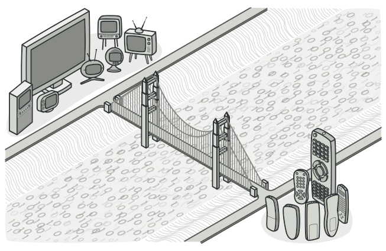
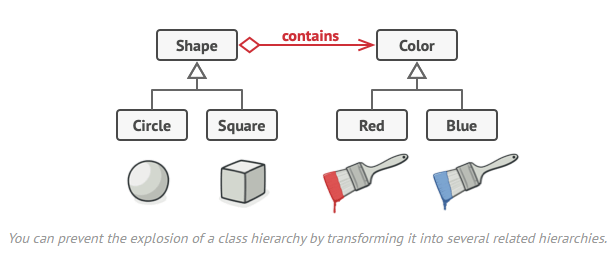
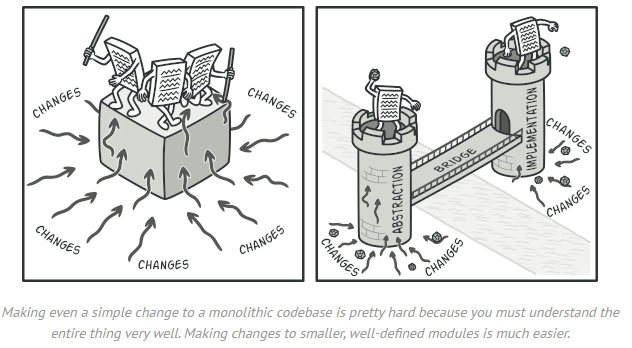

# State

## Intent :bulb:

**State** is a behavioral design pattern that lets an object alter its behavior when its internal state changes. It appears as if the object changed its class.

## Problem :disappointed:

The State pattern is closely related to the concept of a [Finite-State Machine](https://en.wikipedia.org/wiki/Finite-state_machine).

The main idea is that, at any given moment, there’s a *finite* number of *states* which a program can be in. Within any unique state, the program behaves differently, and the program can be switched from one state to another instantaneously. However, depending on a current state, the program may or may not switch to certain other states. These switching rules, called *transitions*, are also finite and predetermined.

You can also apply this approach to objects. Imagine you're programming an ATM Machine class. We can define some states for ATM Machine.

> Our simplified ATM will work that way: First a user inserts the card to it, then the user has to enter his PIN (If the PIN is wrong ATM will eject the card), after PIN validation user can request cash - ATM will withdraw the cash and ask if the next withdrawal is necessary. If not it will remove the card.
>
> Take on account that sometimes there might not be enough cash in ATM.

We can distinguish 4 states in our ATM Machine:

- No card - idle state, ATM waits for a client
- Has card - user inserted the card. In this state ATM will ask for PIN
- Has Pin - if PIN was correct user is logged in and can withdraw some cash
- No Cash - Sometimes after user withdraw a cash it can occur that ATM is empty, in this state we cannot allow interaction with clients and ATM just waits for admin to be filled with cash.

But first let's define 4 ways user can interact with ATM. For each interaction we will have different outcome depending on the ATM state.

- Insert Card
- Eject Card
- Enter Pin
- Request Cash

> Note that some action are forbidden in certain states eg. You cannot Eject card from ATM in `No Card` state.

**The code problem**

State machines are usually implemented with lots of conditional operators (`if` or `switch`) that select the appropriate behavior depending on the current state of the object. Usually, this “state” is just a set of values of the object’s fields. 

The biggest weakness of a state machine based on conditionals reveals itself once we start adding more and more states and state-dependent behaviors to the `ATMMachine` class. Most methods will contain monstrous conditionals that pick the proper behavior of a method according to the current state. Code like this is very difficult to maintain because any change to the transition logic may require changing state conditionals in every method.

The problem tends to get bigger as a project evolves. It’s quite difficult to predict all possible states and transitions at the design stage. Hence, a lean state machine built with a limited set of conditionals can grow into a bloated mess over time.

## Solution :happy:

The State pattern suggests that you create new classes for all possible states of an object and extract all state-specific behaviors into these classes.

Instead of implementing all behaviors on its own, the original object, called *context*, stores a reference to one of the state objects that represents its current state, and delegates all the state-related work to that object.

To transition the context into another state, replace the active state object with another object that represents that new state. This is possible only if all state classes follow the same interface and the context itself works with these objects through that interface.

## Structure :building_construction:

##  Applicability :computer:

- **Use the State pattern when you have an object that behaves differently depending on its current state, the number of states is enormous, and the state-specific code changes frequently.**
  - The pattern suggests that you extract all state-specific code into a set of distinct classes. As a result, you can add new states or change existing ones independently of each other, reducing the maintenance cost.

- **Use the pattern when you have a class polluted with massive conditionals that alter how the class behaves according to the current values of the class’s fields**.
  - The State pattern lets you extract branches of these conditionals into methods of corresponding state classes. While doing so, you can also clean temporary fields and helper methods involved in state-specific code out of your main class.

- **Use State when you have a lot of duplicate code across similar states and transitions of a condition-based state machine.**
  - The State pattern lets you compose hierarchies of state classes and reduce duplication by extracting common code into abstract base classes.

## How to implement :hammer:

1. Decide what class will act as the context. It could be an existing class which already has the state-dependent code; or a new class, if the state-specific code is distributed across multiple classes.

2. Declare the state interface. Although it may mirror all the methods declared in the context, aim only for those that may contain state-specific behavior.

3. For every actual state, create a class that derives from the state interface. Then go over the methods of the context and extract all code related to that state into your newly created class.

   While moving the code to the state class, you might discover that it depends on private members of the context. There are several workarounds:

   - Make these fields or methods public.
   - Turn the behavior you’re extracting into a public method in the context and call it from the state class. This way is ugly but quick, and you can always fix it later.
   - Nest the state classes into the context class, but only if your programming language supports nesting classes.

4. In the context class, add a reference field of the state interface type and a public setter that allows overriding the value of that field.

5. Go over the method of the context again and replace empty state conditionals with calls to corresponding methods of the state object.

6. To switch the state of the context, create an instance of one of the state classes and pass it to the context. You can do this within the context itself, or in various states, or in the client. Wherever this is done, the class becomes dependent on the concrete state class that it instantiates.

## Pros and Cons :balance_scale:

**Pros**

- *Single Responsibility Principle*. Organize the code related to particular states into separate classes.
-  *Open/Closed Principle*. Introduce new states without changing existing state classes or the context.
-  Simplify the code of the context by eliminating bulky state machine conditionals.

**Cons**

- Applying the pattern can be overkill if a state machine has only a few states or rarely changes.

## Relations with Other Patterns :family:

- **Bridge**, **State**, **Strategy** (and to some degree **Adapter**) have very similar structures. Indeed, all of these patterns are based on composition, which is delegating work to other objects. However, they all solve different problems. A pattern isn’t just a recipe for structuring your code in a specific way. It can also communicate to other developers the problem the pattern solves.
- **State** can be considered as an extension of **Strategy**. Both patterns are based on composition: they change the behavior of the context by delegating some work to helper objects. *Strategy* makes these objects completely independent and unaware of each other. However, *State* doesn’t restrict dependencies between concrete states, letting them alter the state of the context at will.
