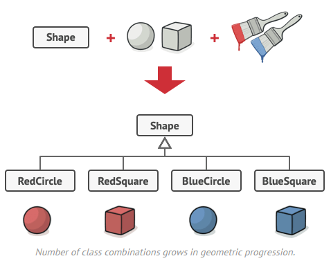
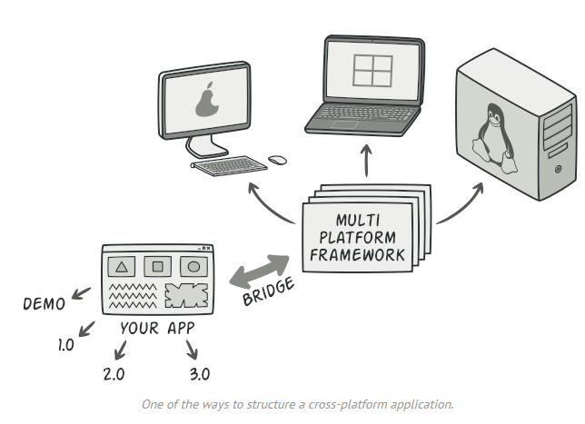
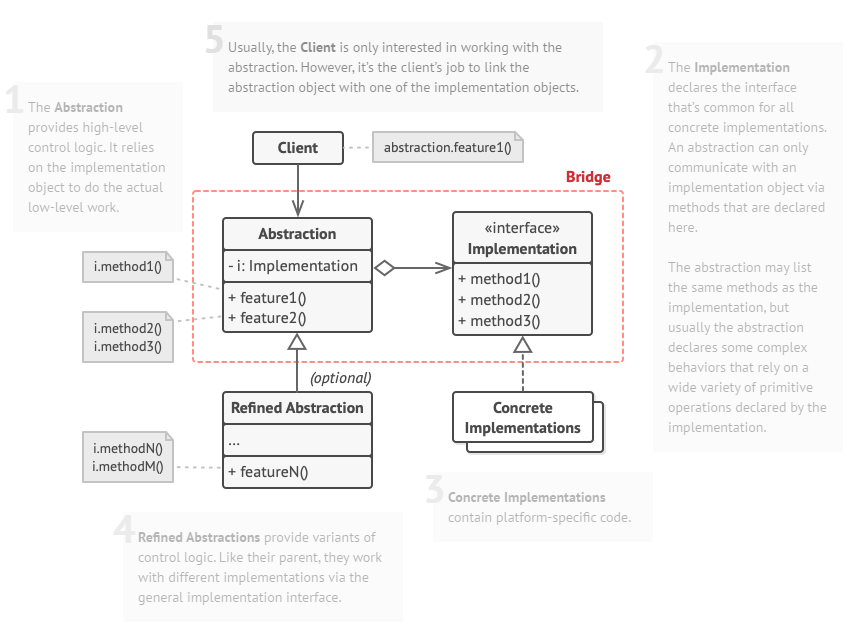

# Decorator

## Intent :bulb:

**Decorator** lets you attach new behaviors to objects by placing these objects inside special wrapper objects that contain the behaviors.

## Problem :disappointed:

Imagine you are working on a notification library, which lets other programs use it to notify something.

You have one `Notifier` class, which has a single method `send()`, which accepts a message argument from program and sends emails to users defined in a constructor.

A third-party program acting as a client code is suppose to create and configure `Notifier` object once, and the use it each time something important happened.

At some point u realize that users of library expect more than just a emails notifications. They would like to notify, by SMS, by Facebook or Slack etc.

So you just extend `Notifier` class into new subclasses.

But the someone asked, what if i want to use several notification types at once? 

Some users wanted facebook with Slack ones, some wanted all of them etc.

You tried to address that problem by creating special subclasses which combined several notification methods within one class. However, it quickly became apparent that this approach would bloat the code immensely, not only the library code but the client code as well.

You have to find some other way to structure notifications classes so that their number won’t accidentally break some Guinness record.

## Solution :happy:

Why not Inheritance?

- Inheritance is static. You can’t alter the behavior of an existing object at runtime.
- Subclasses can have just one parent class. In most languages, inheritance doesn’t let a class inherit behaviors of multiple classes at the same time.

One of the ways to overcome these caveats is by using *Aggregation* or *Composition* instead of *Inheritance*. Both of the alternatives work almost the same way: one object *has a* reference to another and delegates it some work, whereas with inheritance, the object itself *is* able to do that work, inheriting the behavior from its superclass.

“**Wrapper**” is the alternative nickname for the **Decorator** pattern that clearly expresses the main idea of the pattern. A ***wrapper*** is an object that can be linked with some ***target*** object. The wrapper contains the same set of methods as the target and delegates to it all requests it receives. However, the wrapper may alter the result by doing something either before or after it passes the request to the target.

When does a simple wrapper become the real decorator? As I mentioned, the wrapper implements the same interface as the wrapped object. That’s why from the client’s perspective these objects are identical. Make the wrapper’s reference field accept any object that follows that interface.

`Notifier` is a target object. `BaseDecorator` is wrapper. `Wrapee` is an object being wrapped. 

`BaseDecorator` constructor accepts `Notifier` as an argument. And calls it's `send()` method in his.

We have 3 classes inheriting from `BaseDecorator` and we use them to attach behaviors.

Note that these decorators in their overriden method call also the super one.

**How client code uses it?**

Client wraps a basic Notifier object into a set of decorators that match his preferences.

The last decorator in the stack would be the object that the client actually works with. Since all decorators implement the same interface as the base notifier, the rest of the client code won’t care whether it works with the “pure” notifier object or the decorated one.

## Structure :building_construction:

1. The **Component** declares the common interface for both wrappers and wrapped objects.
2. **Concrete Component** is a class of objects being wrapped. It defines the basic behavior, which can be altered by decorators.
3. The **Base Decorator** class has a field for referencing a wrapped object. The field’s type should be declared as the component interface so it can contain both concrete components and decorators. The base decorator delegates all operations to the wrapped object.
4. **Concrete Decorators** define extra behaviors that can be added to components dynamically. Concrete decorators override methods of the base decorator and execute their behavior either before or after calling the parent method.
5. The **Client** can wrap components in multiple layers of decorators, as long as it works with all objects via the component interface.

##  Applicability :computer:

- **Use the Decorator pattern when you need to be able to assign extra behaviors to objects at runtime without breaking the code that uses these objects.**
  - The Decorator lets you structure your business logic into layers, create a decorator for each layer and compose objects with various combinations of this logic at runtime. The client code can treat all these objects in the same way, since they all follow a common interface.
-  **Use the pattern when it’s awkward or not possible to extend an object’s behavior using inheritance.**
  - Many programming languages have the `final` keyword that can be used to prevent further extension of a class. For a final class, the only way to reuse the existing behavior would be to wrap the class with your own wrapper, using the Decorator pattern.

## How to implement :hammer:

1. Make sure your business domain can be represented as a primary component with multiple optional layers over it.
2. Figure out what methods are common to both the primary component and the optional layers. Create a component interface and declare those methods there.
3. Create a concrete component class and define the base behavior in it.
4. Create a base decorator class. It should have a field for storing a reference to a wrapped object. The field should be declared with the component interface type to allow linking to concrete components as well as decorators. The base decorator must delegate all work to the wrapped object.
5. Make sure all classes implement the component interface.
6. Create concrete decorators by extending them from the base decorator. A concrete decorator must execute its behavior before or after the call to the parent method (which always delegates to the wrapped object).
7. The client code must be responsible for creating decorators and composing them in the way the client needs.

## Pros and Cons :balance_scale:

**Pros**

- You can extend an object’s behavior without making a new subclass.
-  You can add or remove responsibilities from an object at runtime.
-  You can combine several behaviors by wrapping an object into multiple decorators.
-  *Single Responsibility Principle*. You can divide a monolithic class that implements many possible variants of behavior into several smaller classes.

**Cons**

-  It’s hard to remove a specific wrapper from the wrappers stack.
-  It’s hard to implement a decorator in such a way that its behavior doesn’t depend on the order in the decorators stack.
-  The initial configuration code of layers might look pretty ugly.

## Relations with Other Patterns :family:

- **Adapter** changes the interface of an existing object, while **Decorator** enhances an object without changing its interface. In addition, *Decorator* supports recursive composition, which isn’t possible when you use *Adapter*.

- **Adapter** provides a different interface to the wrapped object, **Proxy** provides it with the same interface, and Decorator provides it with an enhanced interface.

- **Chain of Responsibility** and **Decorator** have very similar class structures. Both patterns rely on recursive composition to pass the execution through a series of objects. However, there are several crucial differences.

  The *CoR* handlers can execute arbitrary operations independently of each other. They can also stop passing the request further at any point. On the other hand, various *Decorators* can extend the object’s behavior while keeping it consistent with the base interface. In addition, decorators aren’t allowed to break the flow of the request.

- **Composite** and **Decorator** have similar structure diagrams since both rely on recursive composition to organize an open-ended number of objects.

  A *Decorator* is like a *Composite* but only has one child component. There’s another significant difference: *Decorator* adds additional responsibilities to the wrapped object, while *Composite* just “sums up” its children’s results.

  However, the patterns can also cooperate: you can use *Decorator* to extend the behavior of a specific object in the *Composite* tree.

- Designs that make heavy use of **Composite** and **Decorator** can often benefit from using **Prototype**. Applying the pattern lets you clone complex structures instead of re-constructing them from scratch.

- **Decorator** lets you change the skin of an object, while **Strategy** lets you change the guts.

- **Decorator** and **Proxy** have similar structures, but very different intents. Both patterns are built on the composition principle, where one object is supposed to delegate some of the work to another. The difference is that a *Proxy* usually manages the life cycle of its service object on its own, whereas the composition of *Decorators* is always controlled by the client.
